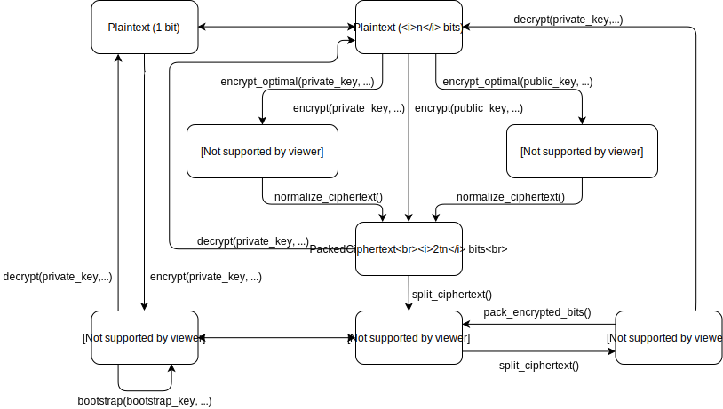

# Manual

```@meta
DocTestSetup = quote
    using Random
    using SGFHE
end
```

## Data flow

The FHE scheme operates with several different representations of ciphertexts, each having its advantages and disadvantages.
The scheme below shows the possible transformations between them and can be used as a quick reference.



In the examples in this section we will assume that the following modules are imported:
```julia
using Random
using SGFHE
```


## Private key encrpytion

We will start with generating a private key use it to encrypt and then decrypt some data.
The simplest variant is to encrypt a single bit:
```jldoctest private-bit
rng = MersenneTwister()
params = Params(64)
key = PrivateKey(params, rng)

bit = true
encrypted_bit = encrypt(key, rng, bit)
decrypted_bit = decrypt(key, encrypted_bit)

@assert bit == decrypted_bit

# output

```

Here we used 64 as the polynomial length in the FHE scheme. The polynomial length must be a power of 2 greater than 64, and the larger it is, the more secure the encryption is (and, naturally, the slower it is, too).

!!! note

    We need to create an RNG and pass it to some functions explicitly.
    All functions that in some way use randomness take an RNG as a parameter, and it is the user's responsibility to assure that it is cryptographically secure (the default Julia one, `MersenneTwister`, isn't, and is only used here for demonstration purposes).

The function [`encrypt`](@ref) applied to a single bit leads to a relatively significant ciphertext expansion (we will need kilobytes of data to represent a single bit).
The space can be used more efficiently if one has an array of bits of length equal to the scheme's polynomial length (64 in our case) they want to encrypt simultaneuously:
```jldoctest private-array
rng = MersenneTwister()
params = Params(64)
key = PrivateKey(params, rng)

bits = rand(Bool, params.n)
encrypted_array = encrypt(key, rng, bits)
decrypted_bits = decrypt(key, encrypted_array)

@assert bits == decrypted_bits

# output

```

The resulting ciphertext only has the expansion coefficient of `2t`, where `t` is the bit size of the integer type used (which is chosen to be able to fit numbers up to `16n`, where `n` is the polynomial length, see [the corresponding theory section](@ref Space-optimal-representation-private) for details).

There an even more efficient representation possible, with the expansion coefficient of only 6.
It cannot be decrypted directly, and must be normalized first:
```jldoctest private-optimal
rng = MersenneTwister()
params = Params(64)
key = PrivateKey(params, rng)

bits = rand(Bool, params.n)
encrypted_array = encrypt_optimal(key, rng, bits)
decrypted_bits = decrypt(key, normalize_ciphertext(encrypted_array))

@assert bits == decrypted_bits

# output

```


## Public key encrpytion

The FHE scheme supports asymmetric encryption.
We can generate a public key out of our private key, and distribute it.
Anyone can use it to encrpyt data, which can be decrypted only by someone possessing the private key.

At the moment one can only use a public key to encrypt arrays of bits:
```jldoctest public-array
rng = MersenneTwister()
params = Params(64)
key = PrivateKey(params, rng)
pkey = PublicKey(rng, key)

bits = rand(Bool, params.n)
encrypted_bits = encrypt(pkey, rng, bits)
decrypted_bits = decrypt(key, encrypted_bits)

@assert bits == decrypted_bits

# output

```

Similarly to the private key encrpytion, one can use an intermediate space-efficient representation, although the ciphertext expansion coefficient is larger than that for the private key (namely, `10 + log2(n)`):
```jldoctest public-optimal
rng = MersenneTwister()
params = Params(64)
key = PrivateKey(params, rng)
pkey = PublicKey(rng, key)

bits = rand(Bool, params.n)
encrypted_array = encrypt_optimal(pkey, rng, bits)
decrypted_bits = decrypt(key, normalize_ciphertext(encrypted_array))

@assert bits == decrypted_bits

# output

```


## [Bootstrap](@id Bootstrap-manual)

The main feature of FHE is being able to perform arbitrary operations on the encrypted data.
In the scheme that this package implements, one can take two encrypted bits and obtain ciphertexts encrypting the result of applying `AND`, `OR` and `XOR` operations on the corresponding plaintext bits.
This is enough to implement any logical circuit.

Bootstrapping procedure requires a special bootstrap key, which can be generated from the private key:
```jldoctest bootstrap-bits
rng = MersenneTwister()
params = Params(64)
key = PrivateKey(params, rng)
bkey = BootstrapKey(rng, key)

y1 = true
y2 = false

enc_y1 = encrypt(key, rng, y1)
enc_y2 = encrypt(key, rng, y2)

enc_and, enc_or, enc_xor = bootstrap(bkey, rng, enc_y1, enc_y2)
res_and, res_or, res_xor = [decrypt(key, enc_bit) for enc_bit in (enc_and, enc_or, enc_xor)]

@assert res_and == y1 & y2
@assert res_or == y1 | y2
@assert res_xor == xor(y1, y2)

# output

```

If one passes `nothing` instead of an RNG, bootstrap will be run deterministically, producing the same encrypted bits each time, which may be beneficial for some applications:
```jldoctest bootstrap-bits
enc1_and, enc1_or, enc1_xor = bootstrap(bkey, nothing, enc_y1, enc_y2)
enc2_and, enc2_or, enc2_xor = bootstrap(bkey, nothing, enc_y1, enc_y2)

@assert enc1_and == enc2_and
@assert enc1_or == enc2_or
@assert enc1_xor == enc2_xor

res_and, res_or, res_xor = [decrypt(key, enc_bit) for enc_bit in (enc1_and, enc1_or, enc1_xor)]

@assert res_and == y1 & y2
@assert res_or == y1 | y2
@assert res_xor == xor(y1, y2)

# output

```


## Splitting encrypted arrays

The [`bootstrap`](@ref) function above is applied to encrypted bits, but what if you have an encrypted array, like the ones we created in the examples above?
Such ciphertexts can be split into encrypted bits to use in [`bootstrap`](@ref) (or [`decrypt`](@ref)):
```jldoctest split-ciphertext
rng = MersenneTwister()
params = Params(64)
key = PrivateKey(params, rng)
bkey = BootstrapKey(rng, key)

bits = rand(Bool, params.n)
encrypted_array = encrypt(key, rng, bits)
encrypted_bits = split_ciphertext(encrypted_array)

# we will run bootstrap() on the 10th and the 20th bit
i1 = 10
i2 = 20

y1 = bits[i1]
y2 = bits[i2]

enc_y1 = encrypted_bits[i1]
enc_y2 = encrypted_bits[i2]

enc_and, enc_or, enc_xor = bootstrap(bkey, rng, enc_y1, enc_y2)
res_and, res_or, res_xor = [decrypt(key, enc_bit) for enc_bit in (enc_and, enc_or, enc_xor)]

@assert res_and == y1 & y2
@assert res_or == y1 | y2
@assert res_xor == xor(y1, y2)

# output

```

## Packing encrypted bits

After you finished with your bootstrapped circuit, you are left with a bunch of encrypted bit objects.
They are not very efficient in terms of occupied space, so any `n` (the scheme's polynomial length) encrypted bits can be packed back into an encrypted array.
As opposed to an encrypted array created by [`encrypt`](@ref), the ciphertext expansion coefficient is 8 times larger (`16t` instead of `2t`, where `t` is the bit size of the interger type used), but it is still much better than the coefficient of a separate encrypted bit.

The packing function uses the bootstrap key:
```jldoctest pack-bits
rng = MersenneTwister()
params = Params(64)
key = PrivateKey(params, rng)
bkey = BootstrapKey(rng, key)

bits = rand(Bool, params.n)
encrypted_array = encrypt(key, rng, bits)
encrypted_bits = split_ciphertext(encrypted_array)

new_encrypted_array = pack_encrypted_bits(bkey, rng, encrypted_bits)
decrypted_bits = decrypt(key, new_encrypted_array)

@assert bits == decrypted_bits

# output

```

Similarly to the [`bootstrap`](@ref), if one passes `nothing` as an RNG to [`pack_encrypted_bits`](@ref), the result will be deterministic.
